

<!-- PROJECT LOGO -->
 

  <a href="https://github.com/Fenris22127/ColorSchemeGenerator">
    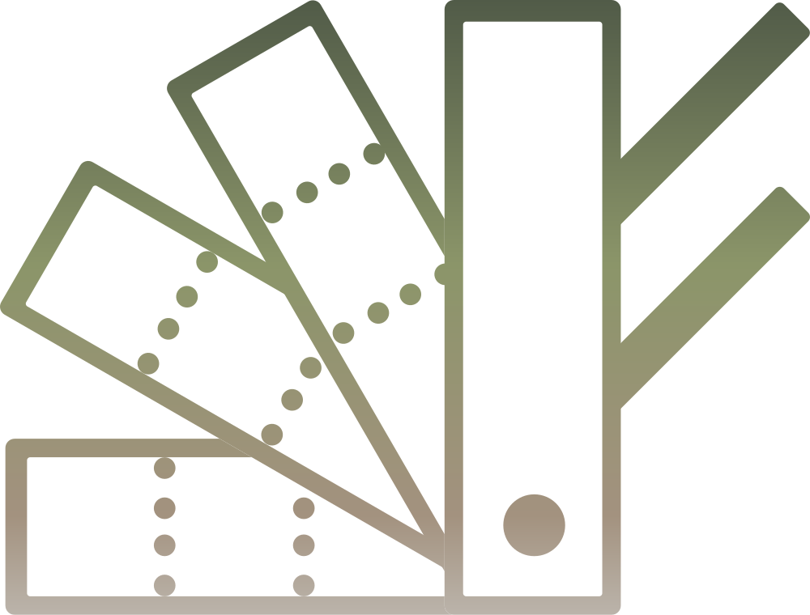
  </a>
  

<h1 id="center">Color Scheme Generator</h1>

  

    This program generates a colour scheme from an image using K-Means clustering and allows the user to save it as a PDF file.
     
    <!--<a href="https://github.com/github_username/repo_name"><strong>Explore the docs »</strong></a>
     
     
    <a href="https://github.com/github_username/repo_name">View Demo</a>
    ·
    <a href="https://github.com/github_username/repo_name/issues">Report Bug</a>
    ·
    <a href="https://github.com/github_username/repo_name/issues">Request Feature</a>-->
  

<!-- TABLE OF CONTENTS -->

  
Table of Contents

  <ol>
    <li>
      <a href="#about-the-project">About The Project</a>
      <ul>
        <li><a href="#built-with">Built With</a></li>
      </ul>
    </li>
    <li>
      <a href="#getting-started">Getting Started</a>
      <ul>
        <li><a href="#prerequisites">Prerequisites</a></li>
        <li>
          <a href="#installation">Installation</a>
          <ol>
            <li><a href="#using-the-color-scheme-generator">Using the Color Scheme Generator</a></li>
          </ol>
        </li>
      </ul>
    </li>
   <li>
      <a href="#usage">Usage</a>
      <ul>
         <li><a href="#general-use">General Use</a></li>
         <li><a href="#output-file-overview">Output File Overview</a></li>
      </ul>
   </li>
    <li><a href="#roadmap">Roadmap</a></li>
    <li><a href="#license">License</a></li>
    <li><a href="#contact">Contact</a></li>
  </ol>

<!-- ABOUT THE PROJECT -->
<h1>About The Project</h1>

    

   On a wonderful day, the 9th of August 2022 to be exact, during a wonderful holiday in Rostock, Germany to clear my mind from that summer's extreme stress and all things uni, I decided that taking a break is for losers, only the strong shall survive and how better to practice my tolerance to constant exposure to stress than to start a coding project during my four days of vacation for the whole year?
   
   So I stood there in the ocean, gently being rocked back and forth by the waves, intently staring at some water insect that had been trying to swim toward me for several minutes at this point, when I decided to look back at the beach and noticed the white houses, green grass, blue ocean and golden sand.
   And I thought "How nice would it be if I could paint this scene with exactly those colours?",
   well knowing that I hadn't touched paint in ages and that landscape painting was absolutely not my thing.
   
   But that did not matter. My mind had already started racing.

   There were a few problems though. The Wi-Fi of the place we were staying had died and so did my high speed, leaving me with no quick way to read up on anything related to creating a colour scheme from an image.
   
   So there I was, armed with only my phone, my tablet I used for drawing, OneNote and my mind going at 100 km/h. I started thinking and writing wild concepts and ideas until some sort of idea had formed. And because planning is for people who don't know where they are going, I started writing code, since I definitely absolutely knew what I was doing and where I was going.
   
   I remembered my professor's words, that we needed to know how to write code on paper as we wouldn't always have a computer and an IDE available, and I cursed my arrogance as I had thought, that if I needed to code, I would use my PC or an online IDE and if I had neither available, I would just not code.
   So I had to fall back on my very limited memory of my first programming classes.
   Luckily for me, due to my bad memory, I write down everything,
   so I had at least some code snippets I could use as a reference for my first lines of code.
   
   I spent my holiday reading up on K-Means Clustering, three-dimensional spaces in Java and different forms of visualizations of colour spaces. And if I am honest, those holidays were amazing. There is a difference between sitting at home and researching and sitting in the sun at the beach in a different city and researching.
   
   When I came home, I transferred my code into my IDE and to my surprise and joy, I had only very few issues to fix until version 1.0 of my Color Scheme Generator was working.

   Since then, I incorporated the iTextPDF library to be able to save the resulting colour scheme, I became friends or at least decided to call a truce with Gradle to better manage my dependencies and recently even cautiously approached maths to add a colour wheel to the file.

   I have also learned a ton about Java,
   gained a lot of experience with managing a project,
   Code Conventions and most importantly, patience and determination and can finally say:
   I am incredibly proud of my project.
   It might not be a revolutionary tool that people are in dire need of, but it is my first large project that I have kept up with and improved as I continued my studies and that is the result of my determination, patience with myself and my love for coding, which I discovered a few months into my first semester at the University of Applied Sciences in Wernigerode, Germany.

<h2>Built With</h2>

[![Java][Java.de]][Java-url]

<!-- GETTING STARTED -->
<h1>Getting Started</h1>

To get a local copy up and running, follow these steps.

<h2> Prerequisites </h2>

This program requires Java 8+ to run properly. How to install Java will be explained in the following steps. If your device is not running on a 64-bit operating system, you cannot use this program. You will also need administrator privileges to install Java.

<h2> Installation </h2>

<h3> Using the Color Scheme Generator </h3>

1. Download the latest release from the [releases page](https://github.com/Fenris22127/ColorSchemeGenerator/releases)
2. Open the file by double-clicking it

See the [documentation](https://github.com/Fenris22127/ColorSchemeGenerator/blob/master/doc/CSG%20-%20Documentation.pdf) for specifics.

> [!WARNING]
> **NEVER** download or open unknown .exe, .jar or other executable files!  
> If you open this without knowing what it is, that is on you.

<!-- USAGE EXAMPLES -->
<h2> Usage </h2>

This program can be used to generate a colour scheme from an image.
The number of colours in the colour scheme can be adjusted.
In addition, several more details about the image will be shown in the output file.
These details include the average colour, saturation,
and brightness of the resulting colour scheme as well as some metadata of the image.

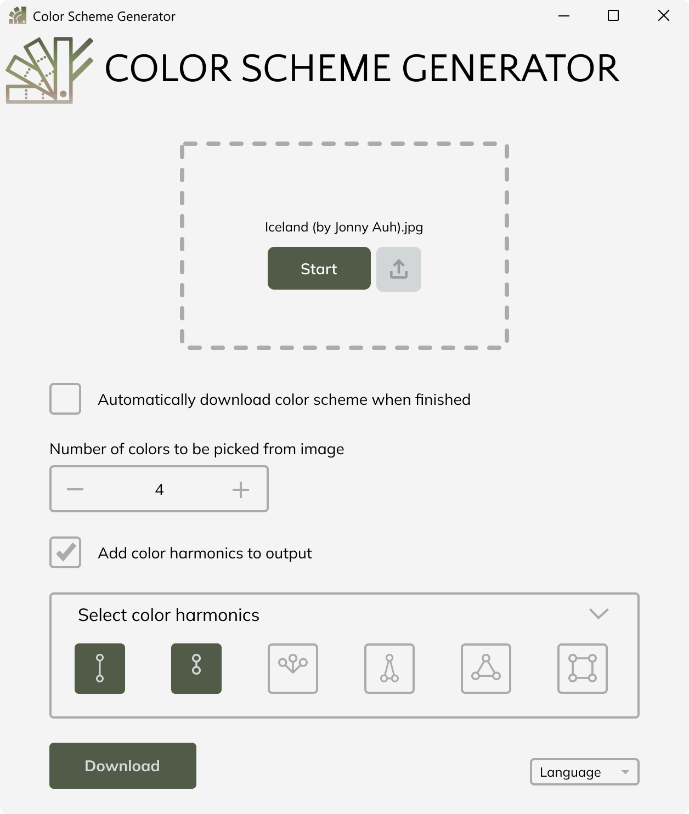

<h3> General use </h3>

#### 1. Click on the Upload panel.
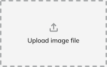

#### 2. Choose your image and click on “Open”.

#### 3. Select, whether you want the colour scheme to be downloaded automatically.
(the file will be saved in your Downloads folder with the name
“ColorScheme_[Filename].pdf”)

#### 4. Choose the number of colours you want to be extracted.
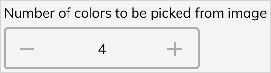

#### 5. Choose, whether you want to add harmonic colours for each extracted colour to the file.
  
If you decided to add harmonic colours,
the dropdown will open where you will be able to select one or more types of colour harmonies.
See here for an explanation of the different types.
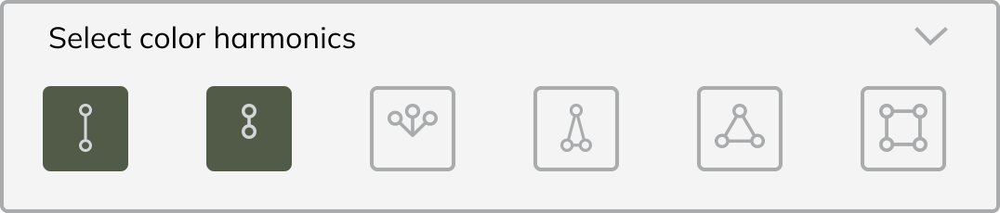

#### 6. Click on “Start” or click the button with the upload symbol to choose a different image.
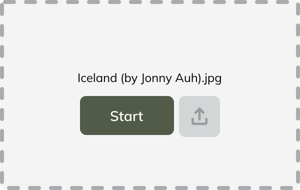

#### 7. When the process has finished, the download button will be enabled, and you’ll be able to download your colour scheme.

#### The file will be called "ColorScheme_[Filename].pdf"
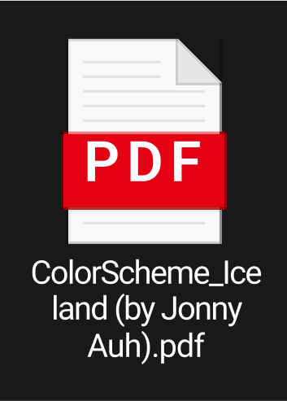

<h3> Output File Overview </h3>

 
Page 1 shows the file name right below the header.
Right next to the selected image (or below, depending on the image size), the chosen number of main colours are listed.
Their colour values are specified in hexadecimal format, as an HSB triplet and as an RGB triplet.
Below the colours are the colour scheme averages,
listing the average colour (more precisely, the average hue), the average saturation and the average brightness.
Note, that this table might be on page 2 if the image is in landscape format.   

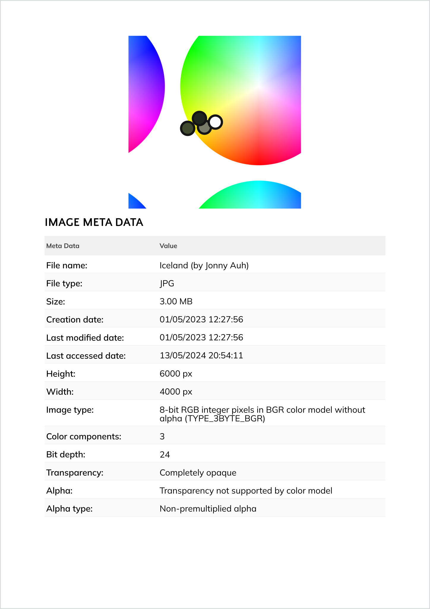  
Page 2 shows the extracted main colours on a colour wheel. Additionally, the selected images meta-data is listed.
Pages 3 and 4 list the selected colour harmonics for the main colours.  
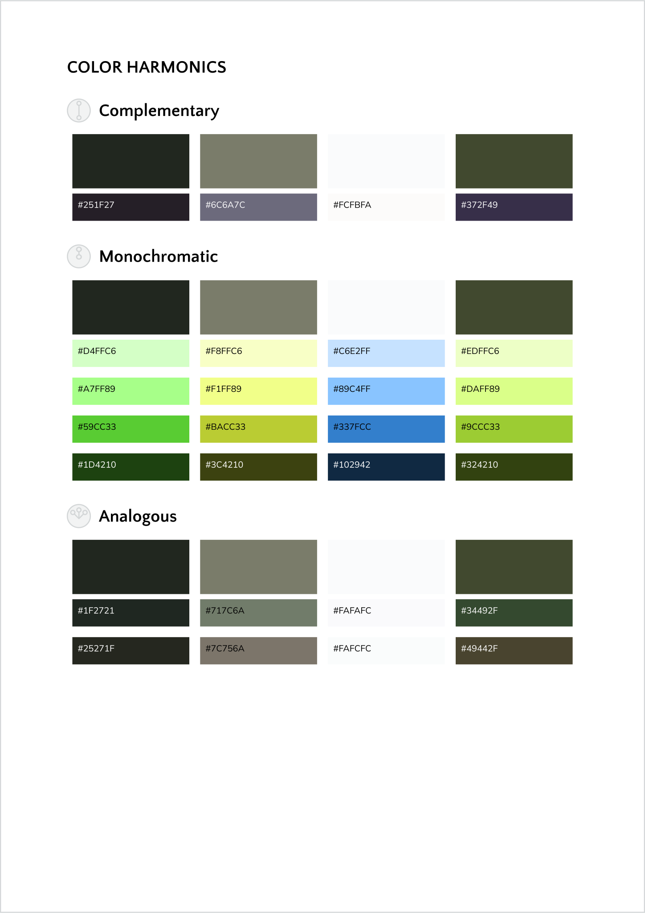
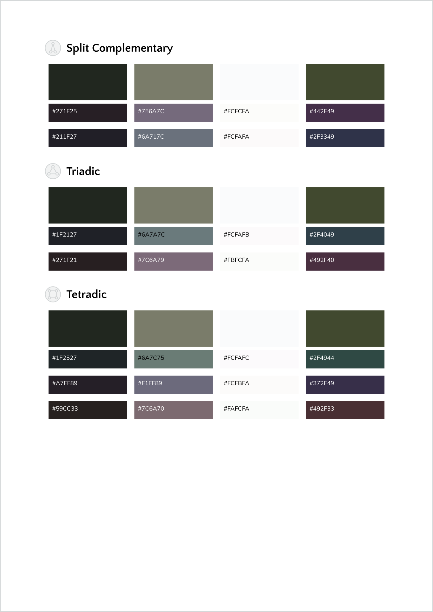

#### 1 — File name
The file name and extension of the chosen image as displayed in the file explorer.

#### 2 — Image
The image chosen by the user that is used to generate the colour scheme.

#### 3 — Colour Scheme
The color scheme generated from the image along with the colour codes in HEX, RGB and HSB.

#### 4 — Colour Wheel
Shows the main colors of the colour scheme in a colour wheel.

#### 5 — Averages of colour scheme
Shows the average colour, whether the colours are saturated or unsaturated on average along the average saturation and 
whether the colours are bright or dark on average along the average brightness.

#### 6 — Metadata of image
Shows the metadata of the image, if available.

##### 6.1 — File name
The display name of the file, which is also displayed in the file explorer. The file title set in the details tab of 
the file properties may differ.

##### 6.2 — File type
Shows you the file type of your file. This is either a "JPG"/"JPEG" (no difference) or a "PNG" since the program only 
accepts files of that type.

##### 6.3 — File size
Shows the file size in the appropriate unit, meaning it is within the 1 - 999.99 range of the unit, except for MB, 
which is in the 0–999.99 range.

##### 6.4 — Creation date
Shows the date and time of the creation of the file according to the time zone of the user.

##### 6.5 — Last modified
Shows the date and time of the last modification of the file according to the time zone of the user. This includes 
modifications that change the files' metadata, such as editing the name, owner or permissions.

##### 6.6 — Last accessed
Shows the date and time of the last time the file has been accessed, meaning it has been opened. This can mean the file 
was opened by the user or a program.

##### 6.7 — Height
Shows the height of the image in pixels. This value might change according to the rotation of the image.

##### 6.8 — Width
Shows the width of the image in pixels. This value might change according to the rotation of the image.

##### 6.9 — Colour Space
A colour space is a range of colours on a spectrum that can be displayed visually.

<picture>
    <source srcset="src/res/images/RGB_light.svg"  media="(prefers-color-scheme: dark)">
    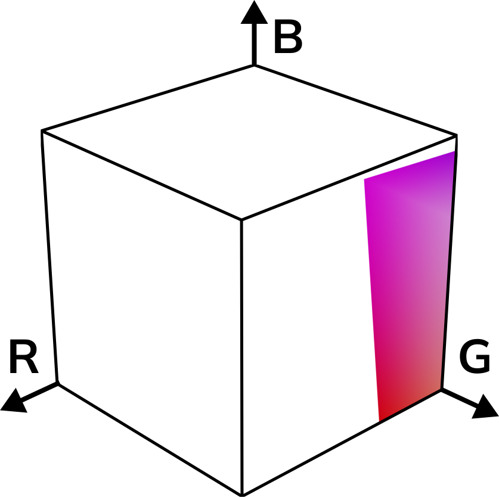
</picture> 
<i>Example of the visualization of the RGB color space</i>  

R stands for red, G stands for green and B stands for blue. When the image supports transparency, the A stands for 
alpha (transparency value).  
These colours have to be stored in a format readable to a computer. Usually, color spaces are 8-bit large, which can be imagined as 8 boxes holding a single colour value.  

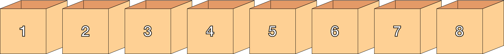  

3 bits store red, 3 bits store green and 2 bits store blue, since the human eye is less sensitive to blue light.  

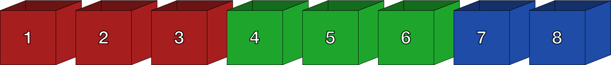  

If the image supports transparency, each colour only gets two bits and the alpha value is stored in the 7th and 8th boxes. 
Usually, the colour space name will contain an A somewhere, like in RGBA.  

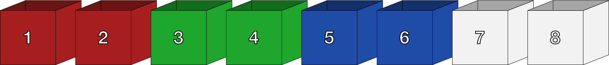  

The boxes holding the colors can be moved around to create different colour spaces like the BGR colour space. This only means that the order of the boxes holding the colours is reversed.  

#### 6.10 — Colour components
Shows the number of colour components of the image. This includes red, green and blue, making for three colour components. If the image supports transparency, the alpha channel is counted as the fourth colour component.

#### 6.11 — Bit depth
This shows the number of bits used to indicate the colour of a pixel. The higher the bit depth, the more bits (boxes) are used to store the colour. With more bits, gradual changes in colour can be displayed more accurately. 
Bit depth is most notable when working with gradients as gradients will start showing clear steps in colour as the bit depth goes down.  

<picture>
    <source srcset="src/res/images/BitDepth_light.png"  media="(prefers-color-scheme: dark)">
    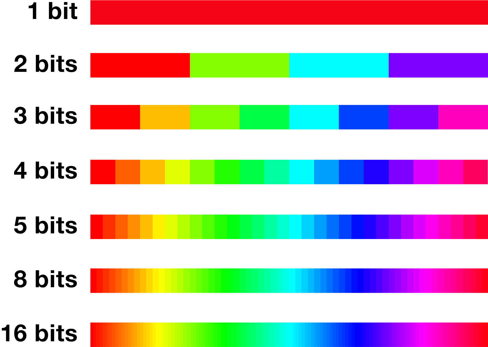
</picture> 

#### 6.12 — Transparency
Shows, how the image supports transparency. If the image does not support transparency, this will be displayed 
as "completely opaque". If transparency is supported, the image is either completely transparent or allows gradual 
steps in transparency (value between 0 and 1).  

#### 6.13 — Alpha
Shows, whether the image supports transparency. If the image does not support transparency, this will be displayed as "Transparency not supported by colour model". If transparency is supported, this will be displayed as "Transparency supported by colour model".  

#### 6.14 — Alpha type
Shows whether the alpha is premultiplied.
This can easily be explained by this quick example,
where we want to add a tree (image 1) to an image of a landscape (image 2).

 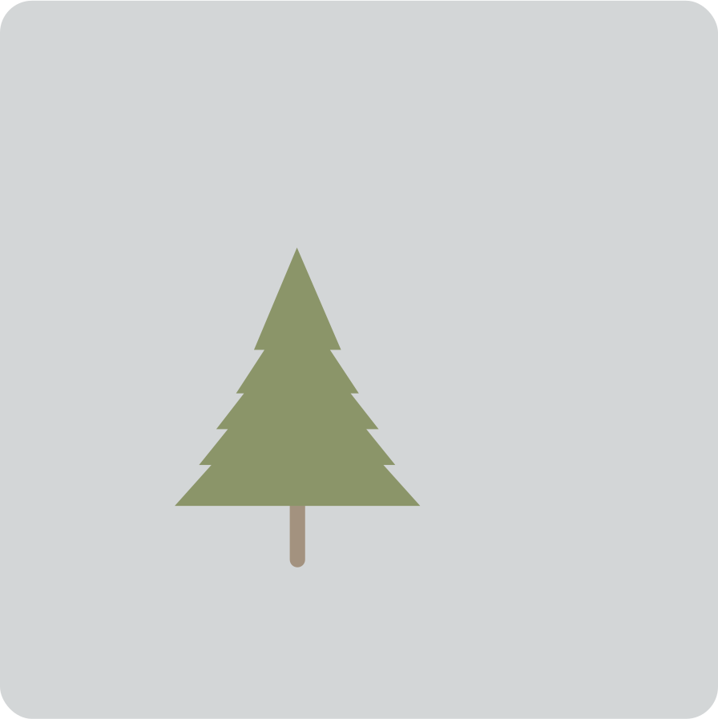
 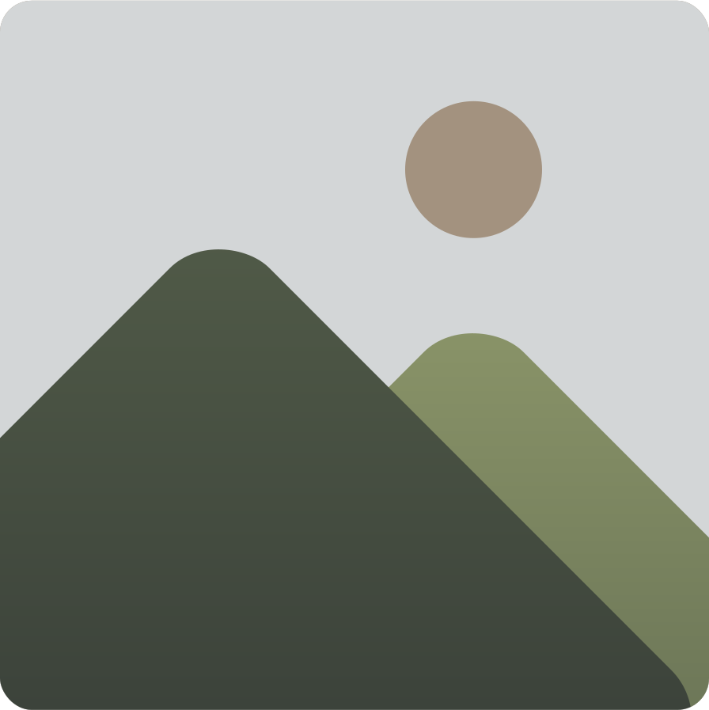

Now, the background of the image with the tree is not transparent,
so if we were to add that image onto image 2, it would cover image 2 completely.
To fix this, we need to create an alpha mask.
The alpha value controls the transparency of an area,
so an alpha mask specifies which areas should remain opaque and which ones should be transparent.
Transparent areas are usually shown as black in the mask, while opaque areas are white.
These masks are applied to the image by multiplying the mask with the image.

<picture>
    <source srcset="src/res/images/Masking1_light.svg"  media="(prefers-color-scheme: dark)">
    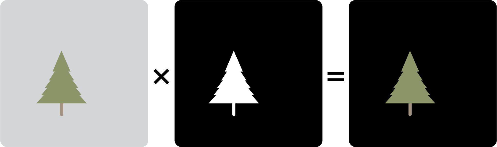
</picture> 

Then, we need to cut out space for the tree on the new background by using the same, but inverted mask. Now everything but the area of the tree is white, meaning only the space, where the tree will be added is transparent.

<picture>
    <source srcset="src/res/images/Masking2_light.svg"  media="(prefers-color-scheme: dark)">
    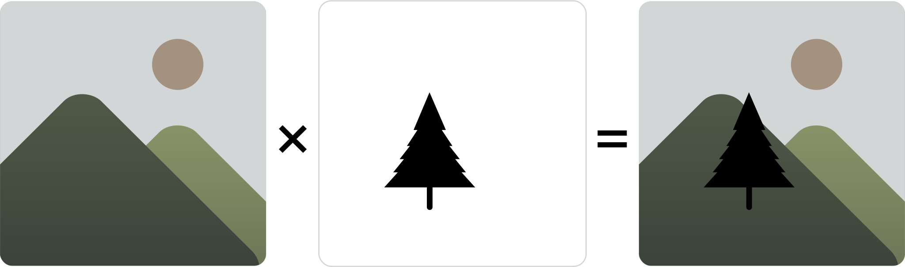
</picture> 
Finally, we can add the masked first image into the masked second image, where it will fill the transparent area.

<picture>
    <source srcset="src/res/images/Masking3_light.svg"  media="(prefers-color-scheme: dark)">
    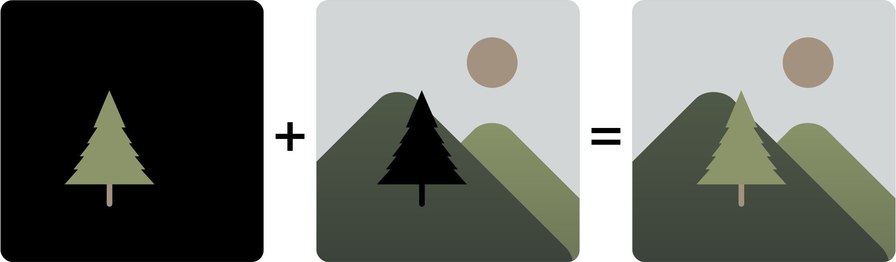
</picture> 

For the first two steps, I used a multiplication symbol to show the mask being applied.
This is because masking means multiplied.
Therefore, premultiplied is pre-masked.
An image with premultiplied alpha already has information about the individual image components.
This could look like this:

<picture>
    <source srcset="src/res/images/Addition_light.svg"  media="(prefers-color-scheme: dark)">
    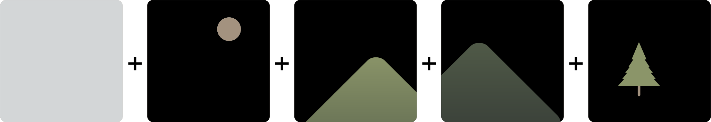
</picture> 

Left: Not masked/not premultiplied, Right: Masked/premultiplied

 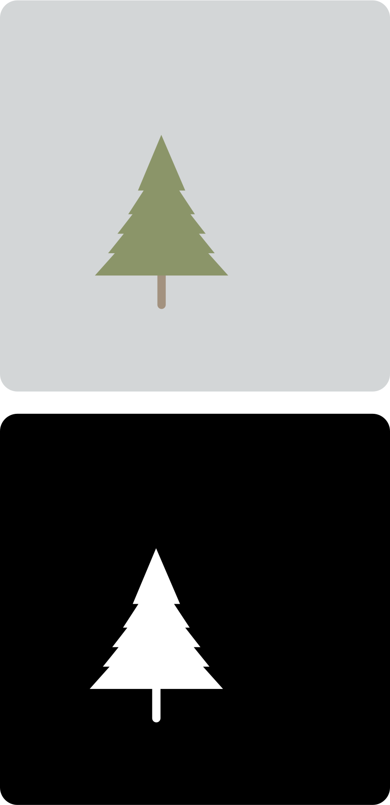
 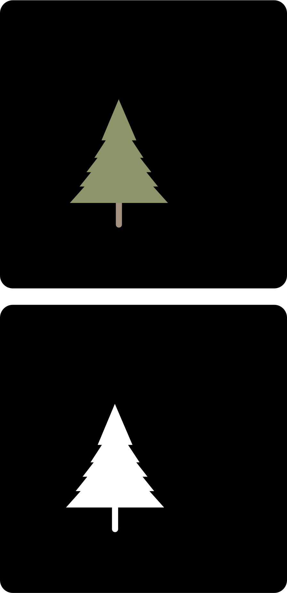

<!-- ROADMAP -->
<h2> Roadmap </h2>

- [x] Finish README
  - [x] Add Usage Examples
  - [x] Add License
- [x] Create Bug Template
- [x] Add documentation
- [ ] ~~Create Commit message guidelines~~
- [x] Add history
- [x] Add Metadata to the image
- [x] Better incorporate colour wheel
- [x] Implement multiple languages (maybe)
- [x] Create an interface using JavaFX
- [ ] ~~Implement the possibility of seeing the result in the interface already~~
- [x] Write a file explaining the mathematical structures used (see: Documentation)
- [x] Write a file explaining the mathematical structures used in simple terms (see: Documentation)
- [x] Explain code (maybe, JavaDocs exist) (see: Documentation)

See the [open issues](https://github.com/Fenris22127/ColorSchemeGenerator/issues) for a full list of proposed features (and known issues). 
To report an issue, please use the [issue template](https://github.com/Fenris22127/ColorSchemeGenerator/blob/master/doc/ISSUE_TEMPLATE.md).

<!-- LICENSE -->
<h2> License </h2>

By using the software, the user agrees to the 
[End User License Agreement](https://github.com/Fenris22127/ColorSchemeGenerator/blob/master/doc/LICENSE.md) and accepts 
the risks of use.

<!-- CONTACT -->
<h2> Contact </h2>

Elisa Johanna Woelk  

![Email][email-shield] 
[![Twitter][twitter-shield]][twitter-url] 
[![Instagram][instagram-shield]][instagram-url] 
[![GitHub][github-shield]][github-url]

Project Link: [https://github.com/Fenris22127/ColorSchemeGenerator](https://github.com/Fenris22127/ColorSchemeGenerator)

<!-- MARKDOWN LINKS & IMAGES -->
<!-- https://www.markdownguide.org/basic-syntax/#reference-style-links -->
[contributors-shield]: https://img.shields.io/github/contributors/github_username/repo_name.svg?style=for-the-badge
[contributors-url]: https://github.com/github_username/repo_name/graphs/contributors
[forks-shield]: https://img.shields.io/github/forks/github_username/repo_name.svg?style=for-the-badge
[forks-url]: https://github.com/github_username/repo_name/network/members
[stars-shield]: https://img.shields.io/github/stars/github_username/repo_name.svg?style=for-the-badge
[stars-url]: https://github.com/Fenris_22127/ColorSchemeGenerator/stargazers
[issues-shield]: https://img.shields.io/github/issues/github_username/repo_name.svg?style=for-the-badge
[issues-url]: https://github.com/github_username/repo_name/issues
[license-shield]: https://img.shields.io/github/license/github_username/repo_name.svg?style=for-the-badge
[license-url]: https://github.com/github_username/repo_name/blob/master/LICENSE.txt
[linkedin-shield]: https://img.shields.io/badge/-LinkedIn-black.svg?style=for-the-badge&logo=linkedin&colorB=555
[linkedin-url]: https://linkedin.com/in/linkedin_username
[product-screenshot]: images/screenshot.png
[email-shield]: https://img.shields.io/badge/--black.svg?style=for-the-badge&logo=microsoftoutlook&colorB=555&label=elisa-johanna.woelk@outlook.de
[twitter-shield]: https://img.shields.io/badge/-Twitter-black.svg?style=for-the-badge&logo=Twitter&colorB=555
[twitter-url]: https://twitter.com/@fenris_22127
[github-shield]: https://img.shields.io/badge/-Github-black.svg?style=for-the-badge&logo=github&colorB=555
[github-url]: https://github.com/Fenris22127
[instagram-shield]: https://img.shields.io/badge/-instagram-black.svg?style=for-the-badge&logo=instagram&colorB=555
[instagram-url]: https://www.instagram.com/fenris_22127/
[Java-url]: https://www.java.com/
[Java.de]: https://img.shields.io/badge/java-41492f?style=for-the-badge&logoColor=fafbfc
[Close-x]: https://img.shields.io/badge/%E2%9C%95-red?style=flat&logoColor=green
