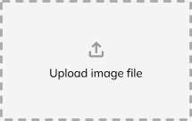

<!-- PROJECT LOGO -->
 

  
  

<h1 id="center">Color Scheme Generator</h1>

  

    This program generates a color scheme from an image using K-Means clustering and allows the user to save it as a
    PDF file.
     
    <!--<a href="https://github.com/github_username/repo_name"><strong>Explore the docs »</strong></a>
     
     
    <a href="https://github.com/github_username/repo_name">View Demo</a>
    ·
    <a href="https://github.com/github_username/repo_name/issues">Report Bug</a>
    ·
    <a href="https://github.com/github_username/repo_name/issues">Request Feature</a>-->
  

<!-- TABLE OF CONTENTS -->

  
Table of Contents

  <ol>
    <li>
      <a href="#about-the-project">About The Project</a>
      <ul>
        <li><a href="#built-with">Built With</a></li>
      </ul>
    </li>
    <li>
      <a href="#getting-started">Getting Started</a>
      <ul>
        <li><a href="#prerequisites">Prerequisites</a></li>
        <li>
          <a href="#installation">Installation</a>
          <ol>
            <li><a href="#installing-java">Installing Java</a></li>
            <li><a href="#using-the-color-scheme-generator">Using the Color Scheme Generator</a></li>
          </ol>
        </li>
      </ul>
    </li>
   <li>
      <a href="#usage">Usage</a>
      <ul>
         <li><a href="#general-use">General Use</a></li>
         <li><a href="#output-file-overview">Output File Overview</a></li>
      </ul>
   </li>
    <li><a href="#-roadmap-">Roadmap</a></li>
    <li><a href="#-license-">License</a></li>
    <li><a href="#contact">Contact</a></li>
  </ol>

<!-- ABOUT THE PROJECT -->
<h1>About The Project</h1>

    

On a wonderful day, the 9th of August 2022 to be exact, during a wonderful holiday in Rostock, Germany to clear my mind from that summers extreme stress and all things uni, I decided that taking a break is for losers, only the strong shall survive and how better to practice my tolerance to constant exposure to stress than to start a coding project during my four days of vacation for the whole year?

So I stood there in the ocean, gently being rocked back and forth by the waves, intently staring at some water insect that had been trying to swim to me for several minutes at this point, when I decided to look back at the beach and noticed the white houses, green grass, blue ocean and golden sand. And I thought "How nice would it be, if I could paint this scene with exactly those colors?", well knowing, that I hadn't touched paint in ages and that landscape painting was absolutely not my thing.

But that did not matter. My mind had already started racing.

There were a few problems though. The Wi-Fi of the place we were staying had died and so did my high speed, leaving me with no quick way to read up on anything related to creating a color scheme from an image.

So there I was, armed with only my phone, my tablet I used for drawing, OneNote and my mind going at 100 km/h. I started thinking and writing wild concepts and ideas, until some sort of idea had formed. And because planning is for people who don't know where they are going, I started writing code, since I definitely absolutely knew what I was doing and where I was going.

I remembered my professor's words, that we needed to know how to write code on paper as we wouldn't always have a computer and an IDE available and I cursed my arrogance as I had thought, that if I needed to code, I would use my PC or an online IDE and if I had neither available, I would just not code. So I had to fall back onto my very limited memory of my first programming classes. Lucky for me, due to my bad memory, I write everything down, so I had at least some code snippets I could use as reference for my first lines of code.

I spent my holiday reading up on K-Means Clustering, three-dimensional spaces in Java and different forms of visualizations of color spaces. And if I am honest, those holidays were amazing. There is a difference between sitting at home and researching and sitting in the sun at the beach in a different city and researching.

When I had come home, I transferred my code into my IDE and to my surprise and joy, I had only very few issues to fix until the version 1.0 of my Color Scheme Generator was working.

Since then, I incorporated the iTextPDF library to be able to save the resulting color scheme, I became friends or at least decided to call a truce with gradle to better manage my dependencies and recently even cautiously approached maths to add a color wheel to the file.

I have also learned a ton about Java, gained a lot of experience with managing a project, Code Conventions and most importantly patience and determination and can finally say: I am incredibly proud of my project. It might not be a revolutionary tool that people are in dire need of, but it is my first large project that I have kept up with and improved as I continued my studies and that is the result of my determination, patience with myself and my love for coding, which I discovered a few months into my first semester at the University of Applied Sciences in Wernigerode, Germany.

<button><a href="#readme-top">Back to top</a></button>

## Built With

[![Java][Java.de]][Java-url]

<!-- GETTING STARTED -->
# Getting Started

To get a local copy up and running follow these steps.

## Prerequisites

This program requires Java 18+ to run properly. How to install Java will be explained in the following steps. If your device is not running on a 64-bit operating system, you cannot use this program. You will also need administrator privileges to install Java.

## Installation

### Installing Java
1. Find out which bit-version your operating system is running on:

    * #### Windows 11:
      1. Open your settings
      2. Open the `About` page in the `System` tab
      3. You will see your bit version in the `Device Specifications` tab under `System type` 
        <b>Example:</b>
        <code><b>64-bit</b> operating system, <b>x64</b>-based processor</code>
    * #### Windows 10:
      1. Open your settings
      2. Open the `System` page, then click on `About`
      3. You will see your bit version in the `Device Specifications` tab under `System type`, below the Windows Defender details 
        <b>Example:</b>
        <code><b>64-bit</b> operating system, <b>x64</b>-based processor</code>
    * #### Mac (until Version 10.11):
      1. Click on the Apple Logo in the upper left corner
      2. Open the `About This Mac` page
      3. You will see your processor below the operating system and computer model name. If your processor appears on the following list, your device is running on a <b>64-bit</b> operating system. If you have a processor not listed here, your device is running on a <b>32-bit</b> operating system.
          * Core 2 Duo
          * Dual-core Xeon
          * Quad-core Xeon
          * Core i3
          * Core i5
          * Core i7
    * #### Mac (Version 10.11+):
      1. Open your Spotlight, search `Terminal` and open it
      2. You should now see two lines of text: your last login and in line 2 `[device name]:~ [username]$`
      3. Place your cursor at the end of line 2 (make sure to leave a whitespace between the cursor and the `$`)
      4. Type `getconf LONG_BIT` and hit Enter
      5. The number being displayed in the following line is the bit-version of your device
    * #### Linux:
      1. Press `Ctrl + Alt + T` to open the terminal
      2. Type `getconf LONG_BIT` and hit Enter
      3. The number being displayed in the following line is the bit-version of your device

2. Install Java from the [Oracle Archive](https://www.oracle.com/java/technologies/javase/jdk18-archive-downloads.html) by downloading the following
  * Windows: `Windows x64 Installer`
  * Mac: `macOS x64 DMG Installer`
  * Linux: `Linux x64 Compressed Archive`

3. Execute the JDK Installer by double-clicking it, click `yes` if it requests system permission

4. Now, the Installer Welcome Screen should open. Click on `Next` to change the installation location if required. Click `Next` again to start the installation. After successfully installing Java, you can click `Close`.

<b>The following steps might not be necessary but should be followed, if the program does not work.</b>

5. To verify the installation, open the Terminal (on Windows, press the Windows key and search for `Terminal`)

6. Type `java -version` and hit enter. You should see this:
    
    `PS C:\Users\[YourName]> java -version` 
    `java version "[Java Version]" [Release date]` 
    `Java(TM) SE Runtime Environment (build [Version+Build Nr])`
    

7. If the version number matched the version you installed, you can skip the following steps. If not, here is how to proceed: 
    * Windows: 
      1. Windows 11: Press the Windows key and enter `environment variables`, then open `Edit the system environment variables` 
      Windows 10: Press `Windows key + R` and enter `sysdm.cpl` into the dialogue, then hit enter
      2. A window `System Properties` should have opened. Switch to the `Advanced` Tab
      3. Click on `Environment Variables`
      4. Under `System Variables` look for `JAVA_HOME`
          * If it is there, double-click it and verify, that the variable value is the path to the installed Java version. This is usually `C:\Program Files\Java\[jdk-##]` with the `##` representing the version number (e.g. Java 18 would be jdk-18)
          * If it is not there, click `New`, enter `JAVA_HOME` as the variable name and the path to the installed Java version (usually `C:\Program Files\Java\[jdk-##]` with the `##` representing the version number) as the variable value
      5. Then look for `PATH` and double-click it. If not already there, click `New` and add `%JAVA_HOME%\bin`
      6. Close the windows with the `OK` buttons
      7. Press the Windows key and type in `Terminal`, but run it as an administrator by right-clicking it and then clicking `Run as administrator`
      8. Enter `echo %JAVA_HOME%` and hit enter. The file path to the java version should now be displayed.
      9. Then enter `javac --version` and hit enter again. The java version should now be displayed.
      10. Press the Windows key and type in `Control Panel`, open the `Programs` page and click on `Java`
      11. Switch to the `Java` tab in the window that should have opened and click on `View`
      12. A new window with a table should now open. Click on `Find` and then on `Next` in the JRE Finder
      13. Enter the file path to the Java installation as determined in Step 4 and click on `Finish`
      14. Should there be more than your downloaded version of Java in the table, disable the old one by unselecting the checkbox in the column titled `Enabled`
      15. Click `Okay`, then `Apply` and pat yourself on the shoulder because Good job! You did it! (Maybe restart your PC though)
    * MacOS:
      1. Open your Spotlight, search `Terminal` and open it
      2. Find the path to the target file by typing `~/.bash-profile` and hitting enter
      3. Open the file at the provided location with a text editor of your choice (e.g. Notepad, programs like Microsoft Word will not work the same)
      4. Add the following to the file (the file path may vary but usually is at this location)
          `export %JAVA_HOME%=C:\Program Files\Java\[jdk-##]`
      5. Save the file (the original file should now be modified)
      6. Execute the new file by reopening the Terminal
    * Linux:
      1. To be added... (perhaps)

<button><a href="#readme-top">Back to top</a></button>

### Using the Color Scheme Generator
1. Download the latest release file from the [releases page](https://github.com/Fenris22127/ColorSchemeGenerator/releases)
2. Open the file by double clicking it

See the [documentation](#) for specifics.

<b>NEVER download or open unknown .exe, .jar or other executable files!</b>

<b>If you open this without knowing what it is, that is on you.</b>

<!-- USAGE EXAMPLES -->
## Usage

### General use

#### 1. Choose the amount of colors you want to be extracted
 

#### 2. Choose, whether you want your file to be automatically downloaded when finished
 

#### 3. Click on "Upload"
 

#### 4. Choose your image and click on "Open"
 

#### 5. Wait until the program has finished and the text field show "Done!"
 

#### 6. Click on download and select the location where the file will be saved to

#### The file will be called "ColorScheme_[Filename].pdf"

### Output File Overview

 

#### 1 - File name
The file name and extension of the chosen image as displayed in the file explorer.

#### 2 - Image
The image chosen by the user that is used to generate the color scheme.

#### 3 - Color Scheme
The color scheme generated from the image along with the color codes in HEX, RGB and HSB.

#### 4 - Color Wheel
Shows the main colors of the color scheme in a color wheel.

#### 5 - Averages of color scheme
Shows the average color, whether the colors are saturated or unsaturated on average along the average saturation and 
whether the colors are bright or dark on average along the average brightness.

#### 6 - Metadata of image
Shows the metadata of the image, if available.

##### 6.1 - File name
The display name of the file, which is also displayed in the file explorer. The file title set in the details tab of 
the file properties may differ.

##### 6.2 - File type
Shows you the file type of your file. This is either a "JPG"/"JPEG" (no difference) or a "PNG" since the program only 
accepts files of that type.

##### 6.3 - File size
Shows the file size in the appropriate unit, meaning it is within the 1 - 999.99 range of the unit, except for MB, 
which is in the 0 - 999.99 range.

##### 6.4 - Creation date
Shows the date and time of the creation of the file according to the time zone of the user.

##### 6.5 - Last modified
Shows the date and time of the last modification of the file according to the time zone of the user. This includes 
modifications that change the files' metadata, such as editing the name, owner or permissions.

##### 6.6 - Last accessed
Shows the date and time of the last time the file has been accessed, meaning it has been opened. This can mean the file 
was opened by the user or a program.

##### 6.7 - Height
Shows the height of the image in pixels. This value might change according to the rotation of the image.

##### 6.8 - Width
Shows the width of the image in pixels. This value might change according to the rotation of the image.

##### 6.9 - Color Space
A color space is a range of colors on a spectrum that can be displayed visually.

  
<i>Example of the visualisation of the RGB color space</i>  
R stands for red, G stands for green and B stands for blue. When the image supports transparency, the A stands for 
alpha (transparency value).  
These colors have to be stored in a format readable for a computer. Usually, color spaces 
are 8-bit large, which can be imagined as 8 boxes that can hold a single color value.   
   
3 bits store red, 3 bits store green and 2 bits store blue, since the human eye is less sensitive to blue light.   
   
If the image supports transparency, each color only gets two bits and the alpha value is stored in the 7th and 8th box. 
Usually, the color space name will contain an A somewhere, like in RGBA. 
The boxes holding the colors can be moved around to create different color spaces like the BGR color space. This only 
means that the order of the boxes holding the colors is reversed.  

#### 6.10 - Color components
Shows the amount of color components of the image. This includes the red, green and blue, making for three color 
components. If the image supports transparency, the alpha channel is counted as the fourth color component.

#### 6.11 - Bit depth
This shows the amount of bits used to indicate the color of a pixel. The higher the bit depth, the more bits (boxes) 
are used to store the color. With more bits, gradual changes in color can be displayed more accurately. 
Bit depth is most notable when working with gradients as gradients will start showing clear steps in color as the bit 
depth goes down.  

#### 6.12 - Transparency
Shows, how the image supports transparency. If the image does not support transparency, this will be displayed 
as "completely opaque". If transparency is supported, the image is either completely transparent or allows gradual 
steps in transparency (value between 0 and 1).  

#### 6.13 - Alpha
Shows, whether the image supports transparency. If the image does not support transparency, this will be displayed as 
"Transparency not supported by color model". If transparency is supported, this will be displayed as 
"Transparency supported by color model".  

#### 6.14 - Alpha type
Shows, whether the alpha is premultiplied. If not, the alpha value simply specifies how solid a color is, meaning the 
alpha value can be decreased without changing the RGB channels and still result in a transparent pixel.  
If the alpha channel is premultiplied however, the RGB channels and the alpha channel are linked. To create a completely 
transparent pixel, the RGB channels and the alpha channel have to be set to 0.  

<!-- ROADMAP -->
## 🚧 Roadmap 🚧

- [x] Finish README
  - [x] Add Usage Examples
  - [x] Add License
- [x] Create Bug Template
- [ ] Add documentation
- [ ] Create Commit message guidelines
- [x] Add history
- [x] Add Metadata to image
- [x] Better incorporate color wheel
- [x] Implement multiple languages (maybe)
- [x] Create an interface using JavaFX
- [ ] Implement possibility to see result in interface already
- [ ] Write file explaining mathematical structures used
- [ ] Write file explaining mathematical structures used in simple terms
- [ ] Explain code (maybe, JavaDocs exist)

See the [open issues](https://github.com/Fenris22127/ColorSchemeGenerator/issues) for a full list of proposed features (and known issues). 
To report an issue, please use the [issue template](https://github.com/Fenris22127/ColorSchemeGenerator/blob/master/doc/ISSUE_TEMPLATE.md).

<!-- LICENSE -->
## License
By using the software, the user agrees to the 
[End User License Agreement](https://github.com/Fenris22127/ColorSchemeGenerator/blob/master/doc/LICENSE.md) and accepts 
the risks of use.

<!-- CONTACT -->
## Contact

Elisa Johanna Woelk  

![Email][email-shield] 
[![Twitter][twitter-shield]][twitter-url] 
[![Instagram][instagram-shield]][instagram-url] 
[![GitHub][github-shield]][github-url]

Project Link: [https://github.com/Fenris22127/ColorSchemeGenerator](https://github.com/Fenris22127/ColorSchemeGenerator)

<button><a href="#readme-top">Back to top</a></button>

<!-- MARKDOWN LINKS & IMAGES -->
<!-- https://www.markdownguide.org/basic-syntax/#reference-style-links -->
[contributors-shield]: https://img.shields.io/github/contributors/github_username/repo_name.svg?style=for-the-badge
[contributors-url]: https://github.com/github_username/repo_name/graphs/contributors
[forks-shield]: https://img.shields.io/github/forks/github_username/repo_name.svg?style=for-the-badge
[forks-url]: https://github.com/github_username/repo_name/network/members
[stars-shield]: https://img.shields.io/github/stars/github_username/repo_name.svg?style=for-the-badge
[stars-url]: https://github.com/Fenris_22127/ColorSchemeGenerator/stargazers
[issues-shield]: https://img.shields.io/github/issues/github_username/repo_name.svg?style=for-the-badge
[issues-url]: https://github.com/github_username/repo_name/issues
[license-shield]: https://img.shields.io/github/license/github_username/repo_name.svg?style=for-the-badge
[license-url]: https://github.com/github_username/repo_name/blob/master/LICENSE.txt
[linkedin-shield]: https://img.shields.io/badge/-LinkedIn-black.svg?style=for-the-badge&logo=linkedin&colorB=555
[linkedin-url]: https://linkedin.com/in/linkedin_username
[product-screenshot]: images/screenshot.png
[email-shield]: https://img.shields.io/badge/--black.svg?style=for-the-badge&logo=microsoftoutlook&colorB=555&label=elisa-johanna.woelk@outlook.de
[email-url]: #
[twitter-shield]: https://img.shields.io/badge/-Twitter-black.svg?style=for-the-badge&logo=Twitter&colorB=555
[twitter-url]: https://twitter.com/@fenris_22127
[github-shield]: https://img.shields.io/badge/-Github-black.svg?style=for-the-badge&logo=github&colorB=555
[github-url]: https://github.com/Fenris22127
[instagram-shield]: https://img.shields.io/badge/-instagram-black.svg?style=for-the-badge&logo=instagram&colorB=555
[instagram-url]: https://www.instagram.com/fenris_22127/
[Java-url]: https://www.java.com/
[Java.de]: https://img.shields.io/badge/java-41492f?style=for-the-badge&logoColor=fafbfc
[Close-x]: https://img.shields.io/badge/%E2%9C%95-red?style=flat&logoColor=green

 <!-- #center {
    text-align: center;
  }
#right {
    text-align: right;
  }
#code {
    color: #dddddd;
    background-color: #161616;
    padding: 1rem;
    font-family:Consolas,Monaco,Lucida Console,Liberation Mono,DejaVu Sans Mono,Bitstream Vera Sans Mono,Courier New;
    border-radius: 0.2rem;
    margin-bottom: 1rem;
  }
  #code span {
    color: #888888;
  }
  #warning {
    color: red;
    font-weight: 700;
    font-size: 1.2rem;
    text-align: center;
  }
  #subwarning {
    color: #EF0000;
    font-size: 0.8rem;
    text-align: center;
  }
  button {
    background-color: #c2fbd7;
    border-radius: 6.25rem;
    box-shadow: 
          rgba(44,187,99,.35) 0 -1.56rem 1.125rem -0.875rem inset,
          rgba(44,187,99,.25) 0 0.063rem 0.125rem,
          rgba(44,187,99,.25) 0 0.125rem 0.25rem;
    color: green;
    cursor: pointer;
    display: inline-block;
    padding: 0.44rem 1.25rem;
    text-align: center;
    text-decoration: none;
    transition: all 250ms;
    border: 0;
    font-size: 0.69rem;
    user-select: none;
    -webkit-user-select: none;
    touch-action: manipulation;
    margin-top: 1rem;
  }
  button a {
      color: green;
  }
  h1 {
    margin: 1.25rem 0 0.313rem 0;
  }
</style>

-->
