# Concepts used in the program

## 1 K-Means Clustering
A K-Means clustering algorithm is an algorithm for grouping a number of values (observations) into a set number of clusters. Each observation belongs to the cluster with the mean value that's closest to the observations value. This mean value will be recalculated several times according to the amount of values that are currently assigned to its cluster. The aim of this is to minimize variances of the values of the observations within the clusters to the mean value of the cluster. These mean values are called "centroids". The amount of clusters must be less or equal to the amount of values to group. 

The algorithm works as follows:
1. Each observation is assigned to the cluster with the nearest mean value, which is determined by calculating the <a href="#euclidean-distance">euclidean distance</a> (-> img. 2 & 3)  
Note, that an observation can only be assigned to one cluster at once
2. Recalculate the mean value (-> img. 1 & 3)
3. Repeat step 1.-2. until the assignments no longer change or the minimum variance has been reached

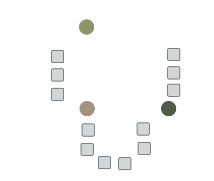
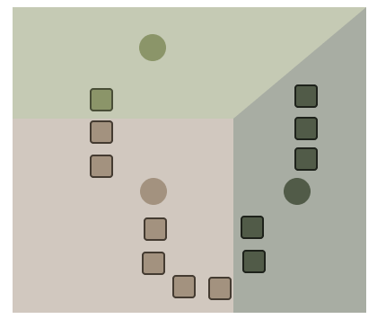
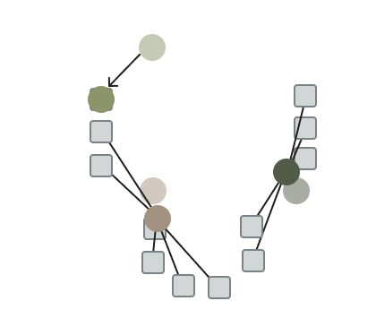
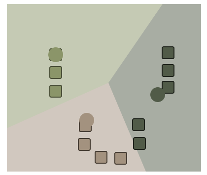

### 1.1 K-Means++
* spreading out the k initial cluster centers
1. Choose one center uniformly at random among the data points.
2. For each data point not chosen yet, compute the distance between the point and the nearest center that has already been chosen.
3. Choose one new data point at random as a new center, using a weighted probability distribution where a point is chosen with probability proportional to D(x)2.
4. Repeat Steps 2 and 3 until k centers have been chosen.
5. Now that the initial centers have been chosen, proceed using standard

### 1.2 Euclidean Distance

## 2 Genetic Algorithms
A genetic algorithm is designed to solve problems by using the same processes as in nature. It is inspired by Charles
Darwin's theory of natural evolution. This algorithm reflects the process of natural selection where the fittest individuals are selected for reproduction.

The algorithm starts with a set of values called population. Values, called individuals, which are selected to reproduce, are selected according to their fitness,
meaning the more suitable they are, the higher is the chance to be selected.

### 2.1 Fitness
If no other individual is in the population, their fitness value will be set to the highest value possible.
If there are more than just one individual in the population, each individual's fitness is determined by the distance 
of the individuals vale to the target value. The closer the value is to the target value, the higher is the fitness value.

In this case, there are multiple target values. The algorithm tests the current individual against each target value 
and if the distance to a target value is smaller than the current fitness value, the distance becomes the new fitness.

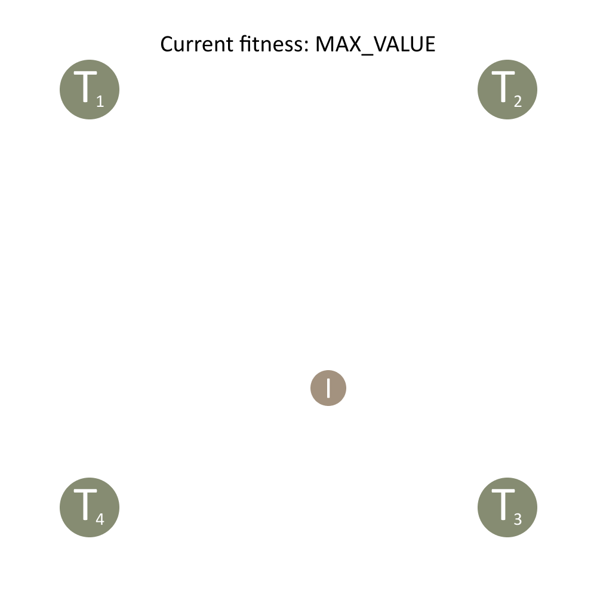
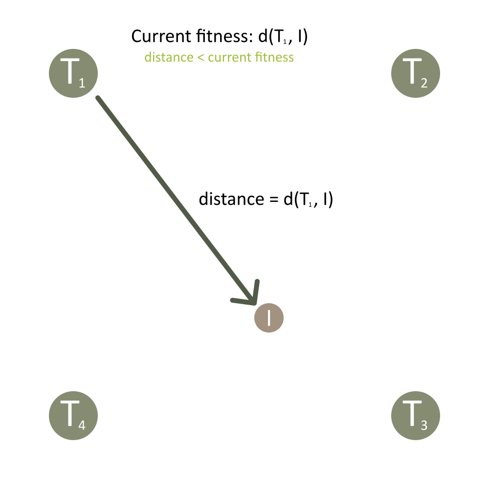   
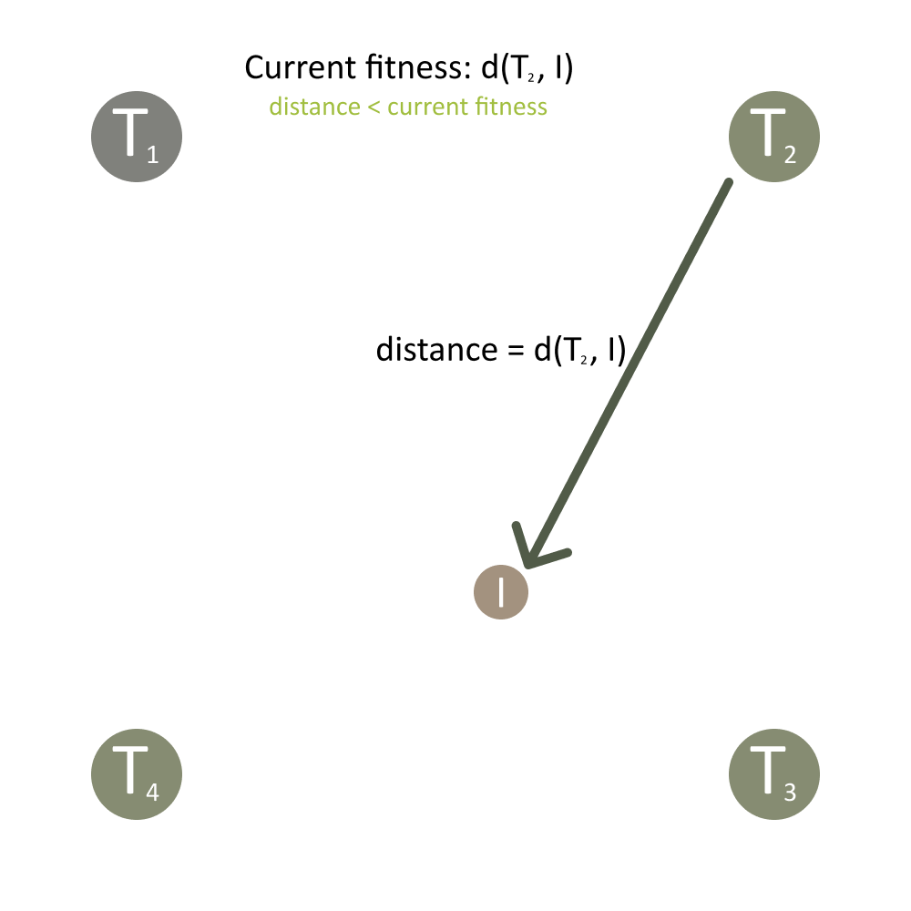
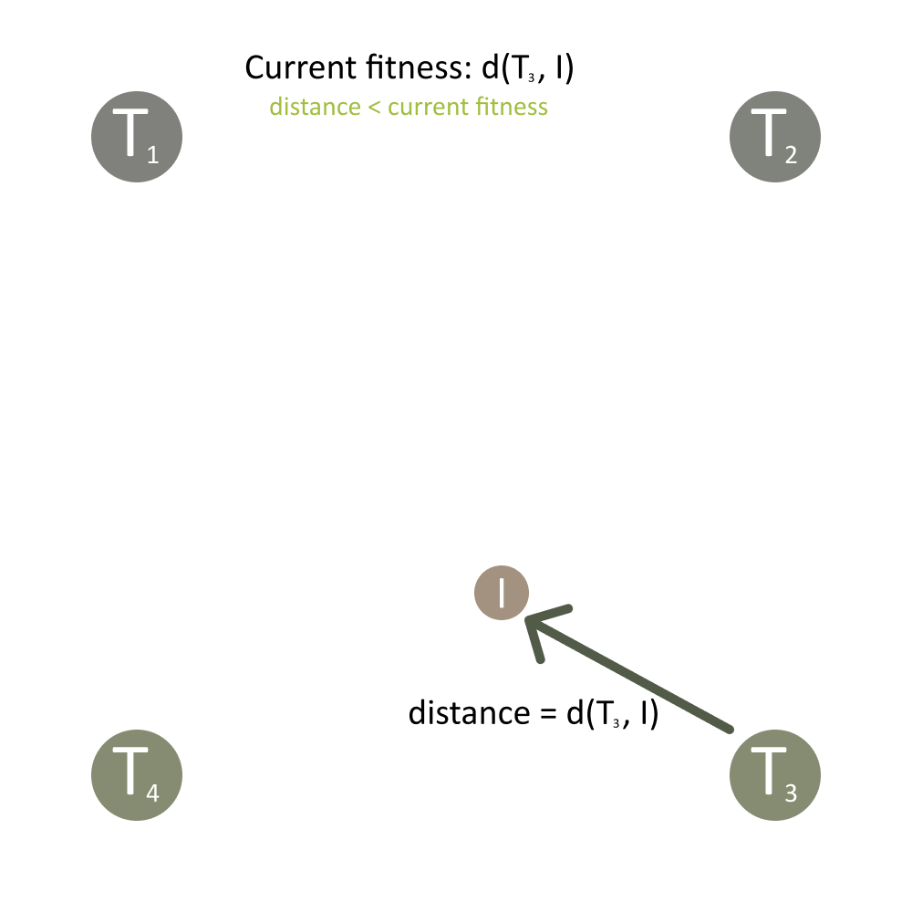   
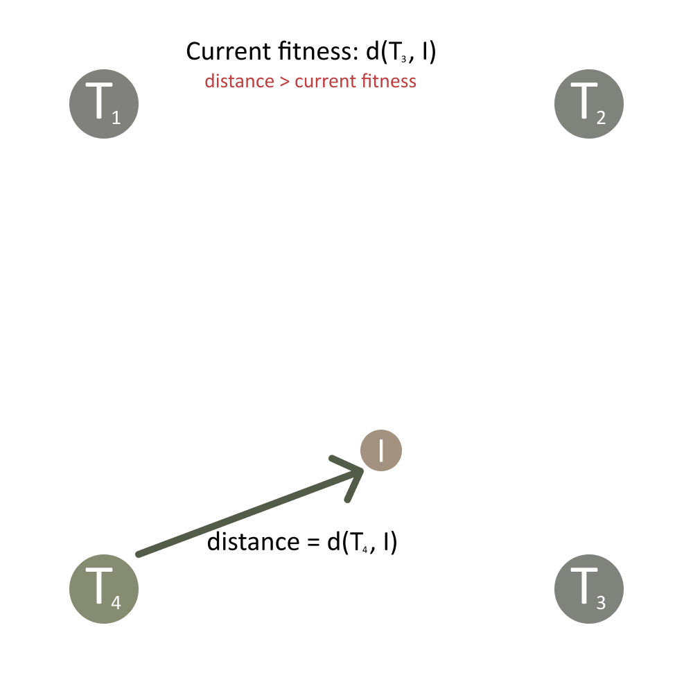  

### 2.2 Roulette Wheel Selection
Roulette selection is a selection method, where the probability for selection of an individual is proportional to its 
fitness. Real-life roulette wheels always have slots with the same size:
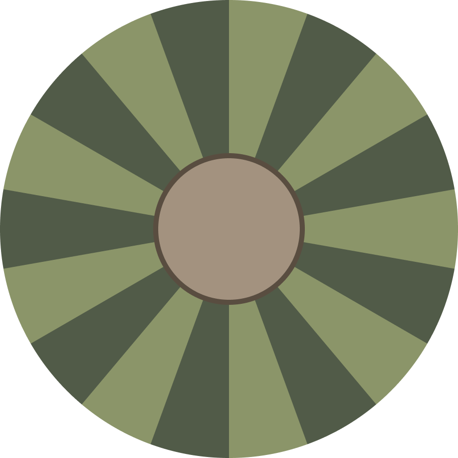

That means, that all slots have the same probability of being selected. If some slots are larger than others, the 
probability of the ball ending up in that slot is higher. The same principle is used in the roulette wheel selection.
The larger the fitness of an individual is, the more likely is its selection:
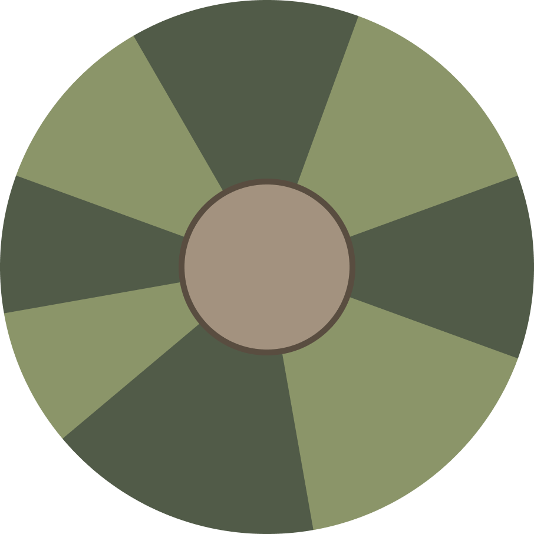

The algorithm starts by summing up the fitness values of all individuals. Then, a random value between 0 and the sum of all fitness values is selected, which will act as the threshold.

Then, the algorithm iterates through each individual in the population and starts summing up their corresponding fitness values again. When adding the fitness of an individual to the sum of the fitness values of all previous individuals surpasses the threshold, this individual will be selected.

## 3 3D Color Spaces